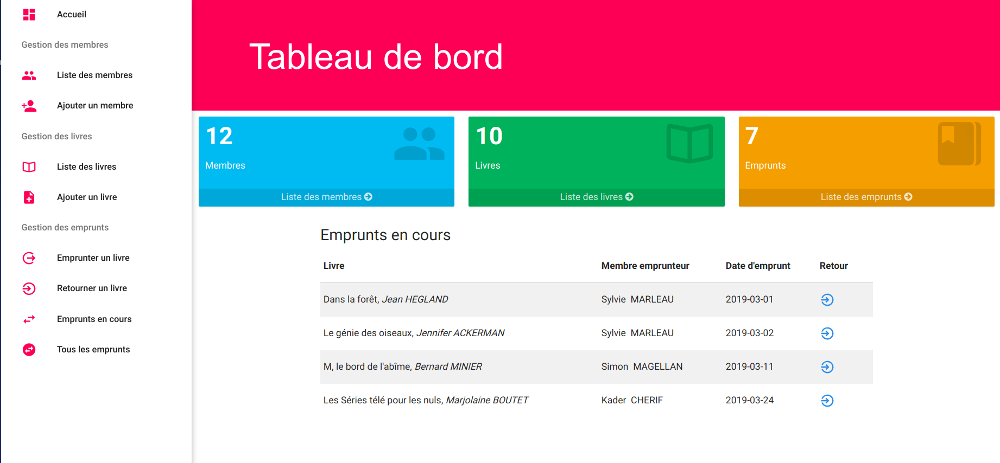

# Library Manager

This code provides a fully functional library manager. It manages the members and the books aswell as the borrows of a specific library.

Beware, this library manager does not handle any access rights. Indeed, this application does not restrict any user to access it nor to modify the data.

## Techno

The code is divided in four parts:
- The database: jdbc
- The sever: Java Servlet
- The front: jsp
- The tests: Junity

The front is served by a tomcat apache server.

Note: This project allowed me to test web applications using java.
As a matter of fact, I strongly advice against this type of stack for these kind of projects.
Indeed, it is too verbose to do a simple application such as this one.
I may recommend using a lighter server such as nodeJs, with a postgres Database (if you want to keep using SQL) or with mongoDB. For the front, you may use simple html with some simple Vanilla Js. You can also use ejs (or anything similar) if you like to keep the jsp mindset. With these stack, you will be more flexible and way faster.

## Quick start

Make sure that you have maeven installed.

To compile the code:

`mvn install`

You now have a .war in target folder. You just need to serve it using tomcat apache with a version >= 8.
